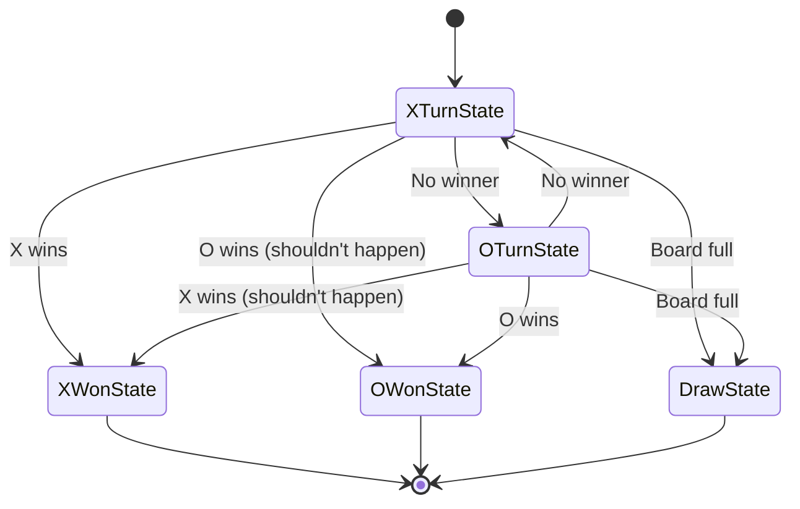
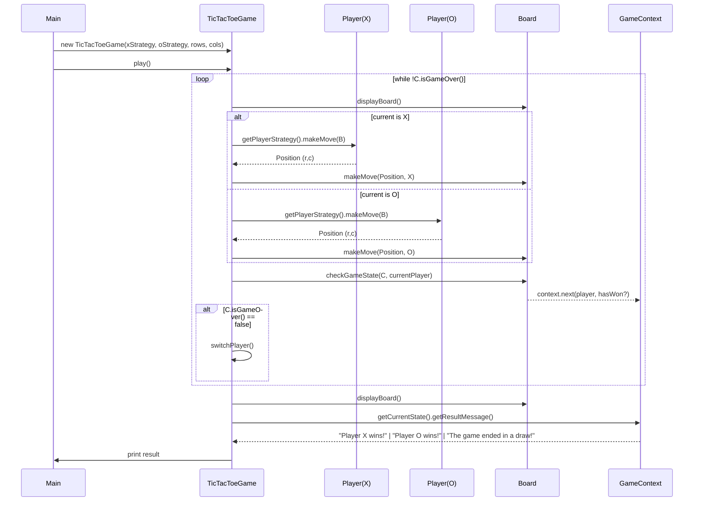
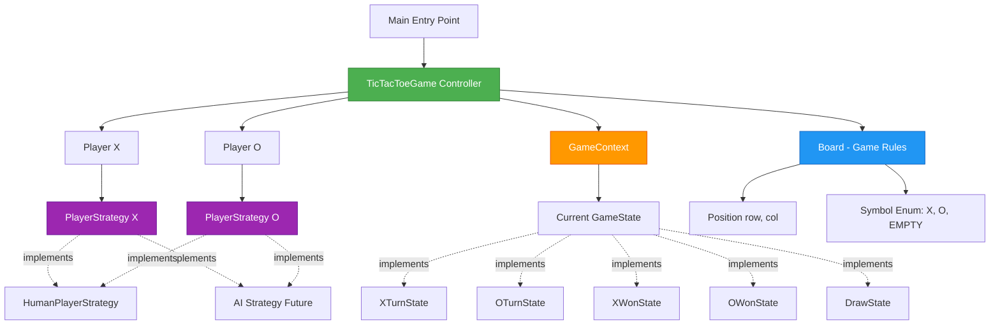

# Building Tic-Tac-Toe That Even Your Future Self Will Thank You For

*How three design patterns transformed a childhood game into a masterclass in clean architecture*

---

You know that feeling when you open code you wrote six months ago and think, "Who wrote this mess?" 

Yeah, we've all been there.

Today, we're building Tic-Tac-Toe. But not just any Tic-Tac-Toe. We're building one that's so clean, so extensible, that when your manager asks you to "add an AI player by tomorrow," you'll smile instead of panic.

**Here's what makes this special:** We're using three battle-tested design patterns that work together like a well-rehearsed orchestra. By the end, you'll see how Strategy, State, and Controller patterns transform a simple game into production-ready code.

Let's dive in.

---

## The Problem: Why Most Tic-Tac-Toe Implementations Suck

Picture this: You're interviewing at a tech company. They ask you to build Tic-Tac-Toe. Easy, right?

Most candidates write something like this:

```java
// ❌ The nightmare begins...
public void playGame() {
    while(true) {
        if(currentPlayer == 'X') {
            // 50 lines of X logic
            if(checkWin()) {
                System.out.println("X wins!");
                return;
            }
        } else {
            // 50 lines of O logic (copy-pasted from above)
            if(checkWin()) {
                System.out.println("O wins!");
                return;
            }
        }
        // More if-else chains...
    }
}
```

**What's wrong here?**

1. **Rigid player logic** — Want to add an AI? Good luck untangling that if-else mess.
2. **Scattered state management** — Win conditions buried in loops? That's a debugging nightmare.
3. **Tight coupling** — Everything knows about everything. Change one thing, break three others.

The interviewer then asks: *"Can you add a computer player?"*

You're now rewriting half your code. Interview over.

**There's a better way.**

---

## The Solution: Three Patterns, One Beautiful System

Think of our Tic-Tac-Toe game like a restaurant:

- **Strategy Pattern** = Different chefs (human player, AI player, random player)
- **State Pattern** = Order status (preparing, ready, delivered)
- **Controller Pattern** = The head waiter orchestrating everything

Each pattern has one job. Together, they create magic.

Let's see how.

---

## Part 1: Strategy Pattern — Swappable Brains

**The Problem:** How do we support different types of players without rewriting our game logic?

**The Analogy:** Think of a chess tournament. You don't care if your opponent is a grandmaster, a beginner, or a computer. You just need them to make a move when it's their turn.

That's exactly what the Strategy Pattern does.

### The Interface: One Rule to Bind Them All

```java
public interface PlayerStrategy {
    Position makeMove(Board board);
}
```

**That's it.** Every player type must implement this one method. The game doesn't care *how* you choose your move—it just needs a `Position` back.

### Human Player: The Console Warrior

```java
public class HumanPlayerStrategy implements PlayerStrategy {
    private Scanner scanner;
    private String playerName;

    public HumanPlayerStrategy(String playerName) {
        this.playerName = playerName;
        this.scanner = new Scanner(System.in);
    }

    @Override
    public Position makeMove(Board board) {
        while(true) {
            System.out.printf("%s, enter your move (row [0-2] and column [0-2]): ", 
                playerName);
            
            try {
                int row = scanner.nextInt();
                int col = scanner.nextInt();
                Position move = new Position(row, col);
                
                if(board.isValidMove(move)) {
                    return move;
                }
                
                System.out.println("Invalid move. Try again.");
            } catch (Exception e) {
                System.out.println("Invalid input. Please enter numbers.");
                scanner.nextLine(); // Clear invalid input
            }
        }
    }
}
```

**What's beautiful here:**

- ✅ Input validation in a loop—no crashes from bad input
- ✅ User-friendly error messages
- ✅ The game logic has NO IDEA this is reading from console

### Want to Add AI? Just Plug It In

```java
// Future you will write this in 10 minutes:
public class MinimaxAIStrategy implements PlayerStrategy {
    @Override
    public Position makeMove(Board board) {
        // Minimax algorithm here
        return bestMove;
    }
}

// In Main.java, just swap the strategy:
PlayerStrategy playerO = new MinimaxAIStrategy(); // That's it!
```

**No changes to the game loop. No if-else chains. Just swap the strategy.**

This is the power of Strategy Pattern—your code is open for extension but closed for modification.

---

## Part 2: State Pattern — The Game's Emotional Journey

**The Problem:** How do we handle different game states (playing, X won, O won, draw) without a million if-statements?

**The Analogy:** Think of a traffic light. It doesn't have a giant switch statement checking "if red, do this; if yellow, do that." Each light *is* a state that knows what to do and what comes next.

### The State Interface

```java
public interface GameState {
    void next(GameContext context, Player player, boolean hasWon);
    boolean isGameOver();
    String getResultMessage();
}
```

Every state knows three things:
1. What state comes next
2. Whether the game is over
3. What message to show

### The Playing States: X's Turn and O's Turn

```java
public class XTurnState implements GameState {
    @Override
    public void next(GameContext context, Player player, boolean hasWon) {
        if(hasWon) {
            // Someone won! Transition to winner state
            context.setState(
                player.getSymbol() == Symbol.X ? new XWonState() : new OWonState()
            );
        } else {
            // No winner yet, O's turn now
            context.setState(new OTurnState());
        }
    }

    @Override
    public boolean isGameOver() {
        return false; // Game continues
    }

    @Override
    public String getResultMessage() {
        return "Game is still in progress.";
    }
}
```

**Notice something magical?** Each state decides what comes next. The game controller doesn't need to know the rules—the states *are* the rules.

### The Terminal States: Victory and Draw

```java
public class XWonState implements GameState {
    @Override
    public void next(GameContext context, Player player, boolean hasWon) {
        // Game over—no more transitions
    }

    @Override
    public boolean isGameOver() {
        return true;
    }

    @Override
    public String getResultMessage() {
        return "Player X has won the game!";
    }
}

public class DrawState implements GameState {
    @Override
    public void next(GameContext context, Player player, boolean hasWon) {
        // Game over—no more transitions
    }

    @Override
    public boolean isGameOver() {
        return true;
    }

    @Override
    public String getResultMessage() {
        return "The game ended in a draw!";
    }
}
```

### The Context: State Manager

```java
public class GameContext {
    private GameState currentState;

    public GameContext() {
        currentState = new XTurnState(); // X always starts
    }

    public void setState(GameState state) {
        this.currentState = state;
    }

    public void next(Player player, boolean hasWon) {
        currentState.next(this, player, hasWon);
    }

    public boolean isGameOver() {
        return currentState.isGameOver();
    }

    public GameState getCurrentState() {
        return currentState;
    }
}
```

**The beauty:** The game controller just asks `context.isGameOver()`. It doesn't need to check if X won, O won, or it's a draw. The state knows.

### State Transition Flow



---

## Part 3: The Board — Where Rules Live

The `Board` class is the referee. It knows the rules, validates moves, and determines winners.

### Board Initialization

```java
public class Board {
    private final int rows;
    private final int cols;
    private Symbol[][] grid;

    public Board(int rows, int cols) {
        this.rows = rows;
        this.cols = cols;
        grid = new Symbol[rows][cols];

        // Initialize empty board
        for(int i = 0; i < rows; i++) {
            for(int j = 0; j < cols; j++) {
                grid[i][j] = Symbol.EMPTY;
            }
        }
    }
}
```

### Move Validation: The Bouncer

```java
public boolean isValidMove(Position pos) {
    if(pos == null) return false;
    
    return pos.row >= 0 && 
           pos.col >= 0 && 
           pos.row < rows && 
           pos.col < cols && 
           grid[pos.row][pos.col] == Symbol.EMPTY;
}

public void makeMove(Position pos, Symbol symbol) {
    if(!isValidMove(pos)) {
        throw new IllegalArgumentException(
            "Invalid move: position out of bounds or already occupied"
        );
    }
    grid[pos.row][pos.col] = symbol;
}
```

**Defensive programming at its finest.** The board protects its integrity—no invalid moves allowed.

### Win Detection: The Judge

```java
public void checkGameState(GameContext context, Player currPlayer) {
    // Check rows
    for(int i = 0; i < rows; i++) {
        if(grid[i][0] != Symbol.EMPTY && isWinningLine(grid[i])) {
            context.next(currPlayer, true);
            return;
        }
    }

    // Check columns
    for(int i = 0; i < cols; i++) {
        Symbol[] column = new Symbol[rows];
        for(int j = 0; j < rows; j++) {
            column[j] = grid[j][i];
        }
        if(column[0] != Symbol.EMPTY && isWinningLine(column)) {
            context.next(currPlayer, true);
            return;
        }
    }

    // Check diagonals
    Symbol[] diag1 = new Symbol[Math.min(rows, cols)];
    Symbol[] diag2 = new Symbol[Math.min(rows, cols)];
    for(int i = 0; i < Math.min(rows, cols); i++) {
        diag1[i] = grid[i][i];
        diag2[i] = grid[i][cols - 1 - i];
    }
    
    if(diag1[0] != Symbol.EMPTY && isWinningLine(diag1)) {
        context.next(currPlayer, true);
        return;
    }
    if(diag2[0] != Symbol.EMPTY && isWinningLine(diag2)) {
        context.next(currPlayer, true);
        return;
    }

    // Check for draw
    boolean isDraw = true;
    outer:
    for(int i = 0; i < rows; i++) {
        for(int j = 0; j < cols; j++) {
            if(grid[i][j] == Symbol.EMPTY) {
                isDraw = false;
                break outer;
            }
        }
    }
    
    if(isDraw) {
        context.next(currPlayer, false); // Draw state
    }
}

private boolean isWinningLine(Symbol[] line) {
    Symbol first = line[0];
    for(Symbol s : line) {
        if(s != first) {
            return false;
        }
    }
    return true;
}
```

**Key insight:** The board tells the context when to transition states. Separation of concerns at its finest.

---

## Part 4: The Controller — The Maestro

Now we bring it all together with `TicTacToeGame`—the controller that orchestrates everything.

### Setup: Wiring the Components

```java
public class TicTacToeGame implements BoardGames {
    private Board board;
    private Player playerX;
    private Player playerO;
    private Player currentPlayer;
    private GameContext gameContext;

    public TicTacToeGame(PlayerStrategy xStrategy, 
                         PlayerStrategy oStrategy, 
                         int rows, int cols) {
        board = new Board(rows, cols);
        playerX = new Player(Symbol.X, xStrategy);
        playerO = new Player(Symbol.O, oStrategy);
        currentPlayer = playerX; // X starts first
        gameContext = new GameContext();
    }
}
```

**Notice:** The controller receives strategies, not concrete player types. This is dependency injection in action.

### The Game Loop: Simple and Elegant

```java
@Override
public void play() {
    do {
        // 1. Show current state
        board.displayBoard();

        // 2. Current player makes a move
        Position move = currentPlayer.getPlayerStrategy().makeMove(board);
        board.makeMove(move, currentPlayer.getSymbol());

        // 3. Check if game is over
        board.checkGameState(gameContext, currentPlayer);
        
        // 4. Switch players (only if game continues)
        if(!gameContext.isGameOver()) {
            switchPlayer();
        }
    } while(!gameContext.isGameOver());
    
    announceResult();
}

private void switchPlayer() {
    currentPlayer = (currentPlayer == playerX) ? playerO : playerX;
}

private void announceResult() {
    board.displayBoard();
    if(gameContext == null || gameContext.getCurrentState() == null) {
        System.out.println("Game result unavailable.");
        return;
    }
    System.out.println(gameContext.getCurrentState().getResultMessage());
}
```

**Look at that game loop.** No if-else chains. No switch statements. No spaghetti code.

Just four clear steps:
1. Display board
2. Get move from current player's strategy
3. Check game state
4. Switch players if needed

**This is what clean code looks like.**

---

## Part 5: The Entry Point — Putting It All Together

```java
public class Main {
    public static void main(String[] args) {
        // Create strategies
        PlayerStrategy playerXStrategy = new HumanPlayerStrategy("Player X");
        PlayerStrategy playerYStrategy = new HumanPlayerStrategy("Player O");
        
        // Create game with 3x3 board
        TicTacToeGame game = new TicTacToeGame(
            playerXStrategy, 
            playerYStrategy, 
            3, 3
        );
        
        // Start the game
        game.play();
    }
}
```

**That's it.** Five lines to start a complete, extensible Tic-Tac-Toe game.

Want to add AI? Change one line:
```java
PlayerStrategy playerYStrategy = new MinimaxAIStrategy();
```

Want a 5x5 board? Change the numbers:
```java
TicTacToeGame game = new TicTacToeGame(xStrategy, oStrategy, 5, 5);
```

**Zero changes to the game logic.**

---

## The Complete Flow: How It All Works Together

Here's the full sequence diagram showing how all components interact:



### What Happens on Each Turn

1. **Display** — Board shows current state
2. **Input** — Strategy provides a move (human input, AI calculation, random choice)
3. **Validate** — Board checks if move is legal
4. **Apply** — Board updates the grid
5. **Evaluate** — Board checks for win/draw and tells GameContext
6. **Transition** — GameContext updates state (XTurn → OTurn, or → XWon, etc.)
7. **Switch** — Controller switches to other player (if game continues)
8. **Repeat** — Loop until `isGameOver()` returns true

---

## The Architecture: A Bird's Eye View



---

## Why This Design Matters: Real-World Benefits

### 1. **Extensibility Without Pain**

Want to add new features? Here's how easy it is:

**Add AI Player:**
```java
public class MinimaxAIStrategy implements PlayerStrategy {
    @Override
    public Position makeMove(Board board) {
        // Minimax algorithm
        return bestMove;
    }
}
```

**Add Random Player:**
```java
public class RandomStrategy implements PlayerStrategy {
    @Override
    public Position makeMove(Board board) {
        // Find random valid position
        return randomValidPosition;
    }
}
```

**Add Network Player:**
```java
public class NetworkPlayerStrategy implements PlayerStrategy {
    @Override
    public Position makeMove(Board board) {
        // Receive move from network
        return moveFromNetwork;
    }
}
```

**Zero changes to the game controller.** That's the power of Strategy Pattern.

### 2. **Testability**

Each component can be tested in isolation:

```java
@Test
public void testBoardWinDetection() {
    Board board = new Board(3, 3);
    GameContext context = new GameContext();
    Player playerX = new Player(Symbol.X, null);
    
    // Create winning condition
    board.makeMove(new Position(0, 0), Symbol.X);
    board.makeMove(new Position(0, 1), Symbol.X);
    board.makeMove(new Position(0, 2), Symbol.X);
    
    board.checkGameState(context, playerX);
    
    assertTrue(context.isGameOver());
    assertTrue(context.getCurrentState() instanceof XWonState);
}
```

### 3. **Maintainability**

Six months from now, when you need to fix a bug:

- **Bug in move validation?** → Check `Board.isValidMove()`
- **Bug in state transitions?** → Check specific `GameState` implementation
- **Bug in player input?** → Check `HumanPlayerStrategy`

Each component has a single responsibility. No hunting through 1000-line files.

### 4. **Scalability**

Want to support different board sizes? Already done:
```java
TicTacToeGame game = new TicTacToeGame(xStrategy, oStrategy, 5, 5);
```

Want to add k-in-a-row rule? Just modify `Board.checkGameState()`:
```java
// Check for k consecutive symbols instead of full row
```

The rest of the system doesn't need to change.

---

## Design Patterns Recap: The Power Trio

### Strategy Pattern
**Purpose:** Define a family of algorithms, encapsulate each one, and make them interchangeable.

**In our game:** Different player types (Human, AI, Random) are interchangeable strategies.

**Benefit:** Add new player types without modifying game logic.

### State Pattern
**Purpose:** Allow an object to alter its behavior when its internal state changes.

**In our game:** Game states (XTurn, OTurn, XWon, OWon, Draw) encapsulate state-specific behavior.

**Benefit:** No if-else chains for state management. Each state knows what comes next.

### Controller/Facade Pattern
**Purpose:** Provide a unified interface to a set of interfaces in a subsystem.

**In our game:** `TicTacToeGame` orchestrates Board, Players, and GameContext.

**Benefit:** `Main` doesn't need to know about internal complexity. Simple API: `game.play()`.

---

## Key Takeaways: Lessons for Your Next Project

1. **Separate concerns** — Board handles rules, Strategies handle moves, States handle transitions
2. **Program to interfaces** — `PlayerStrategy` and `GameState` are interfaces, not concrete classes
3. **Dependency injection** — Controller receives strategies, doesn't create them
4. **Single Responsibility** — Each class has one job and does it well
5. **Open/Closed Principle** — Open for extension (new strategies), closed for modification (game loop unchanged)

---

## What's Next? Extending the System

Here are some challenges to level up your skills:

### Easy Mode
- Add a `RandomPlayerStrategy` that picks random valid moves
- Add a scoreboard that tracks wins across multiple games
- Add input validation for board size in `Main`

### Medium Mode
- Implement `MinimaxAIStrategy` for unbeatable AI
- Add support for custom win conditions (4-in-a-row on 5x5 board)
- Add undo/redo functionality

### Hard Mode
- Add network multiplayer support with `NetworkPlayerStrategy`
- Implement game replay functionality
- Add a GUI using JavaFX or Swing (Strategy Pattern makes this easy!)

---

## The Bottom Line

We started with a simple question: How do we build Tic-Tac-Toe that won't make us cry when requirements change?

The answer: **Three design patterns working in harmony.**

- **Strategy Pattern** makes players swappable
- **State Pattern** makes game flow elegant
- **Controller Pattern** makes everything orchestrated

The result? Code that's:
- ✅ Easy to understand
- ✅ Easy to extend
- ✅ Easy to test
- ✅ Easy to maintain

**This is what separates junior developers from senior engineers.** Not the ability to write code that works, but the ability to write code that *keeps* working as requirements evolve.

Next time you're in an interview and they ask you to build Tic-Tac-Toe, you'll know exactly what to do.

And when they ask, "Can you add an AI player?" you'll smile and say:

*"Give me 10 minutes."*

---

## Complete Project Structure

```
G_Projects/B_TicTac/
├── Main.java                                    # Entry point
├── Controller/
│   └── GameController/
│       └── TicTacToeGame.java                  # Game orchestrator
├── PlayerStrategies/
│   ├── PlayerStrategy.java                      # Strategy interface
│   └── ConcreteStrategy/
│       └── HumanPlayerStrategy.java            # Human player implementation
├── Utility/
│   ├── Board.java                               # Game board and rules
│   ├── Player.java                              # Player wrapper
│   └── Position.java                            # Position data class
├── CentralEnum/
│   └── Symbol.java                              # X, O, EMPTY enum
└── GameStateHandler/
    ├── GameState.java                           # State interface
    ├── Context/
    │   └── GameContext.java                    # State manager
    └── ConcreteStates/
        ├── XTurnState.java                     # X's turn state
        ├── OTurnState.java                     # O's turn state
        ├── XWonState.java                      # X won state
        ├── OWonState.java                      # O won state
        └── DrawState.java                      # Draw state
```

---

**Want to see more low-level design breakdowns?** Drop a comment with the system you'd like me to tackle next. Parking lot? Elevator? Chess? Let me know!

**Found this helpful?** Share it with a friend who's preparing for system design interviews. They'll thank you later.

Until next time, keep your code clean and your designs cleaner. 🚀

---

*P.S. — The complete code is available in the project structure above. Clone it, run it, break it, improve it. That's how you learn.*
