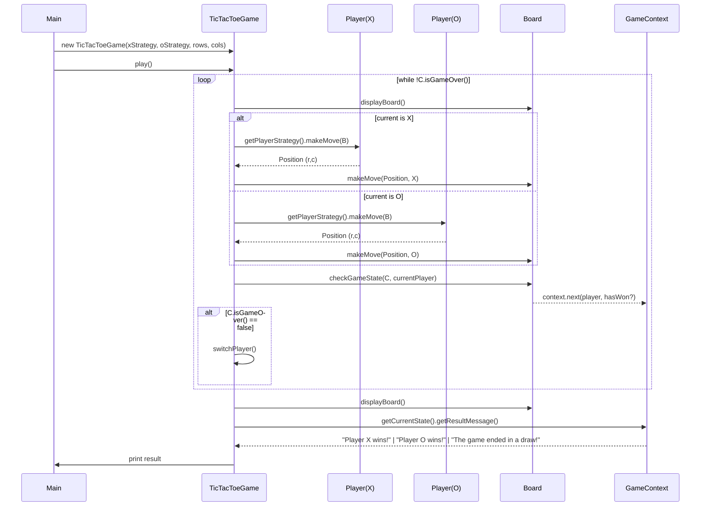

# Tic-Tac-Toe — Architecture and Flow

This document explains how the game components collaborate from `Main` to player strategies, the controller, board, and game state. It also highlights the design patterns in use and what each class is responsible for.

---

## High-level overview

- Entry point: `Main` creates two `PlayerStrategy` instances (e.g., human input) and passes them to `TicTacToeGame`.
- Orchestration: `TicTacToeGame` is the central controller. It drives the game loop, alternating turns and coordinating between players, the board, and the game state.
- State and rules: `Board` maintains the grid, validates and applies moves, and determines win/draw conditions. `GameContext` holds the current `GameState` (X won, O won, or draw).
- Output: After each turn, the board is printed; when the game ends, the result message comes from the current `GameState` (polymorphic — no instanceof needed).

---

## Key components and responsibilities

- `Main` (`G_Projects/B_TicTac/Main.java`)
  - Constructs strategies (X and O) — typically `HumanPlayerStrategy`.
  - Creates `TicTacToeGame` with strategies and board size.
  - Calls `game.play()` to start the game.

- `PlayerStrategy` (interface) and `HumanPlayerStrategy` (concrete)
  - Strategy Pattern.
  - Defines how a player chooses a move.
  - `HumanPlayerStrategy` prompts via console and returns a `Position`.

- `Player` (`G_Projects/B_TicTac/Utility/Player.java`)
  - Holds `Symbol` (X or O) and selected `PlayerStrategy`.
  - Delegates move selection to its strategy.

- `Board` (`G_Projects/B_TicTac/Utility/Board.java`)
  - Owns the grid and game rules evaluation.
  - Validates moves (`isValidMove`), applies moves (`makeMove`), and checks game state (`checkGameState`).
  - Prints the board (`displayBoard`).
  - Win detection: full row/column/diagonal of identical non-empty symbols. Draw: no empty cells and no winner.

- `GameContext` and `GameState` (`G_Projects/B_TicTac/GameStateHandler/...`)
  - State Pattern.
  - `GameContext` holds the current `GameState`.
  - `GameState.next(context, player, hasWon)` transitions to terminal states:
    - `XWonState`, `OWonState`, `DrawState`.
  - `getResultMessage()` encapsulates the presentation of the end result. `TicTacToeGame` prints this message without branching.

- `TicTacToeGame` (`G_Projects/B_TicTac/Controller/GameController/TicTacToeGame.java`)
  - Controller/Facade.
  - Main game loop: display board, ask the current player for a move, apply it, update state, and switch turns until the game is over. Then announce the result.

- Supporting types
  - `Symbol` (enum): `X`, `O`, `EMPTY`.
  - `Position`: immutable row/col pair (row and column indexes).

---

## Design patterns used

- Strategy Pattern — Choosing moves
  - `PlayerStrategy` is the abstraction; `HumanPlayerStrategy` (and potential `MinimaxAI`, `RandomAI`, etc.) are concrete strategies.
- State Pattern — End-of-game states
  - `GameState` is the abstraction; `XWonState`, `OWonState`, `DrawState` are concrete states. `GameContext` holds and changes the active state.
- Controller/Facade — Orchestrating the game
  - `TicTacToeGame` coordinates interaction among strategies, board, and state without leaking their internals to `Main`.

---

## End-to-end flow (sequence)



---

## What happens on a single turn

1. `TicTacToeGame` prints the board via `Board.displayBoard()`.
2. It asks the current `Player`'s strategy for a move (`makeMove(board)`), which returns a `Position`.
   - `HumanPlayerStrategy` reads input from the console and converts it to row/col.
3. `TicTacToeGame` applies the move: `Board.makeMove(position, currentPlayer.getSymbol())`.
   - The board validates that the position is within bounds and empty.
4. `TicTacToeGame` calls `Board.checkGameState(context, currentPlayer)`.
   - If the player formed a winning line, `GameContext` transitions to `XWonState` or `OWonState`.
   - If the board is full with no winner, it transitions to `DrawState`.
5. If the game is not over, `TicTacToeGame` switches to the other player.
6. When the loop ends, `TicTacToeGame` prints the final board and then `context.getCurrentState().getResultMessage()`.

---

## Game state transitions (rules recap)

- Win condition: any one of these is fully occupied by the same non-empty symbol:
  - A row
  - A column
  - A diagonal (top-left to bottom-right)
  - The opposite diagonal (top-right to bottom-left)
- Draw condition: all cells are filled and no win detected.

> Note: The current implementation checks the full row/column/diagonal. If you later support larger boards with k-in-a-row, update the detection logic accordingly.

---

## Typical responsibilities — quick reference

- `Main`
  - Entrypoint, wiring of strategies and controller.
- `TicTacToeGame`
  - Game loop, player switching, result announcement.
- `Player` / `PlayerStrategy`
  - Encapsulate how a move is chosen (human/AI).
- `Board`
  - State of the grid, move validation, rule checks, display.
- `GameContext` / `GameState`
  - Encapsulate terminal result and message; drive end-of-game detection.

---

## Extending the system

- Add AI: implement another `PlayerStrategy` (e.g., `RandomStrategy`, `MinimaxStrategy`) and pass it in from `Main`.
- Change board size: adjust rows/cols in `Main` when constructing `TicTacToeGame`.
- k-in-a-row on larger boards: generalize the winner detection to scan for runs of length k across directions (right, down, diag-down-right, diag-down-left).
- Input/UX: replace `HumanPlayerStrategy` console I/O with GUI or a web front-end while keeping the rest unchanged.

---

## File map (for quick navigation)

- `G_Projects/B_TicTac/Main.java`
- `G_Projects/B_TicTac/Controller/GameController/TicTacToeGame.java`
- `G_Projects/B_TicTac/PlayerStrategies/PlayerStrategy.java`
- `G_Projects/B_TicTac/PlayerStrategies/ConcreteStrategy/HumanPlayerStrategy.java`
- `G_Projects/B_TicTac/Utility/Board.java`
- `G_Projects/B_TicTac/Utility/Player.java`
- `G_Projects/B_TicTac/Utility/Position.java`
- `G_Projects/B_TicTac/CentralEnum/Symbol.java`
- `G_Projects/B_TicTac/GameStateHandler/Context/GameContext.java`
- `G_Projects/B_TicTac/GameStateHandler/GameState.java`
- `G_Projects/B_TicTac/GameStateHandler/ConcreteStates/{XWonState, OWonState, DrawState}.java`

---

## Quick start from Main.java

Here's exactly how your `Main` wires everything together and what happens next.

```java
// G_Projects/B_TicTac/Main.java
package G_Projects.B_TicTac;

import G_Projects.B_TicTac.Controller.GameController.TicTacToeGame;
import G_Projects.B_TicTac.PlayerStrategies.PlayerStrategy;
import G_Projects.B_TicTac.PlayerStrategies.ConcreteStrategy.HumanPlayerStrategy;

public class Main {
    public static void main(String[] args) {
        PlayerStrategy playerXStrategy = new HumanPlayerStrategy("Player X");
        PlayerStrategy playerYStrategy = new HumanPlayerStrategy("Player O");
        TicTacToeGame game = new TicTacToeGame(playerXStrategy, playerYStrategy, 3, 3);
        game.play();
    }
}
```

Step-by-step what happens:
- Two strategies are created: one for X, one for O. Each `HumanPlayerStrategy` will read inputs from the console and return a `Position`.
- `TicTacToeGame` is constructed with these strategies and a 3x3 board:
  - Internally, it creates two `Player` objects (X and O) and an empty `Board(3,3)`.
  - It also initializes a `GameContext` to manage end-state transitions.
- `play()` starts the game loop:
  1) Print the current board (`Board.displayBoard()`).
  2) Ask the current player's strategy for a move (`makeMove(board)`), which returns a `Position`.
  3) Apply the move: `Board.makeMove(position, currentPlayer.getSymbol())` (with bounds/empty checks).
  4) Evaluate the state: `Board.checkGameState(context, currentPlayer)`.
     - If a win is detected, `GameContext` transitions to `XWonState` or `OWonState`.
     - If the board is full and no winner, it transitions to `DrawState`.
  5) If not over, switch player and repeat.
  6) When over, print final board and `context.getCurrentState().getResultMessage()`.

This is a clean separation:
- Main wires and starts the game only.
- The controller (`TicTacToeGame`) orchestrates turns.
- Strategies decide moves.
- The board validates/apply moves and judges the outcome.
- The context/state encapsulates terminal messages.
